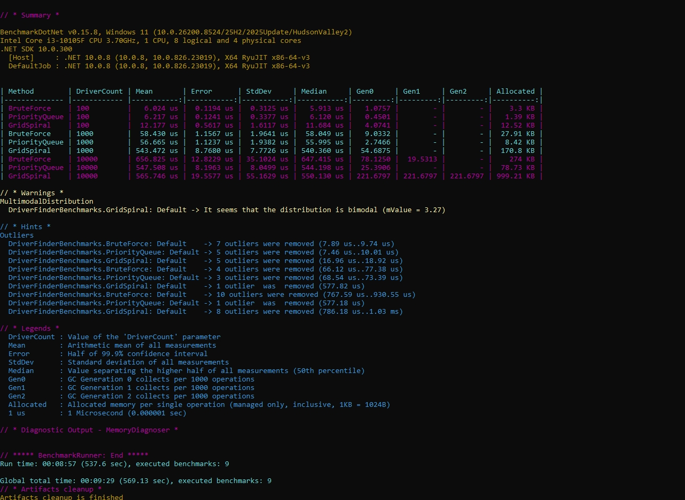

Ride Hailing Driver Matcher

Описание:
Сравнение трёх алгоритмов поиска 5 ближайших водителей на сетке N×M.

Алгоритмы:
- BruteForce — полный перебор и сортировка
- PriorityQueue — куча с ограничением размера
- GridSpiral — поиск по расширяющейся области сетки

Тесты:
Запуск тестов NUnit:

dotnet test

Бенчмарки:
Сравнение производительности с BenchmarkDotNet:

Структура проекта:
- src/RideHailing.Core — библиотека с алгоритмами
- tests/RideHailing.Core.Tests — модульные тесты
- benchmarks/RideHailing.Benchmarks — замеры скорости